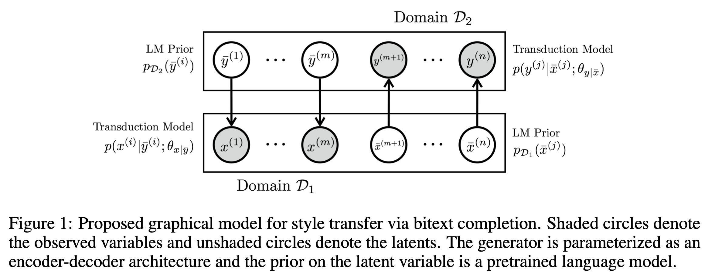

# Deep Latent Sequence Model
This is PyTorch implementation of the [paper](https://arxiv.org/abs/2002.03912): 

```
A Probabilistic Formulation of Unsupervised Text Style Transfer
Junxian He*, Xinyi Wang*, Graham Neubig, Taylor Berg-Kirkpatrick
ICLR 2020
```

The code implements a deep latent sequence model that performs unsupervised style transfer task. Our probabilistic approach models non-parallel data from two domains as a partially observed parallel corpus. By hypothesizing a parallel latent sequence that generates each observed sequence, our model learns to transform sequences from one domain to another in a completely unsupervised fashion.

Please contact junxianh@cs.cmu.edu if you have any quesitons.



## Requirements

* Python 3
* PyTorch >= 1.0

## Data
Datasets used in sentiment transfer, decipherment, author imitation, and related language translation tasks  can be downloaded with:
```
python scripts/prepare_data.py --dataset [yelp|decipher|shakespeare|sr_bos]
```
Downloaded data is located in `./data` folder. For the formality transfer dataset please see its [official repo](https://github.com/raosudha89/GYAFC-corpus).

## Pretrained LMs and Classifiers
**You can skip pretrained LMs if you only want to train a unsupervised NMT baseline to get some starting performance numbers, or skip pretrained classifiers if you are not planning to print out classification accuracy on the validation set during training.**

Our approach requires pretrained LMs as priors for each domain during trainining, and an oracle classifier is required at test time to compute the accuracy for sentiment, author imitation, and formality transfer tasks. Here we provide our pretrained LMs and classifiers to reproduce the reported results. (Note that we pretrain these models in PyTorch 1.4, inconsistent PyTorch versions might cause loading problems.)

Download pretrained lms (located in folder `./pretrained_lm`):
```
python scripts/prepare_lm.py --dataset [yelp|shakespeare|decipher|sr_bos]
```

Download pretrained classifiers (located in folder `./pretrained_classifer`):
```
python scripts/prepare_classifier.py --dataset [yelp|shakespeare|decipher|sr_bos]
```

## Usage
Training:
```
CUDA_VISIBLE_DEVICES=xx bash scripts/[dataset]/train_[dataset].sh
```

Eval:
```
CUDA_VISIBLE_DEVICES=xx bash scripts/[dataset]/eval_all.sh [model dir]
```

The evaluation command will report several evaluation metrics (e.g. accuracy, self-bleu, reference bleu, and ppl for sentiment transfer task) and also transfer the test sentences to another domain, transferred test sentences are saved in `[model dir]`.

**UNMT baseline:** commenting out `--lm` in the training script and make sure to turn on noise options as `--word_blank 0.2 --word_dropout 0.1 --word_shuffle 3`. The added noise is crucial for the UNMT baseline to work. This baseline would not require a pretrained LM.

**Disable classifier validation log:** set `eval_cls` as `False` in the config file, then no classifier would be loaded at training time.


## Train your own LMs and Classifiers

Train LMs:

```
CUDA_VISIBLE_DEVICES=xx bash scripts/train_lm.sh [dataset] [domain_id (0 or 1)]
```

To run the code on your own dataset, you need to create a new configuration file in `./config/` folder to specifiy network hyperparameters and datapath. If the new config file is `./config/config_abc.py`, then `[dataset]` needs to be set as `abc` accordingly. Pretrained LMs are saved in `./pretrained_lm/[dataset]` folder.


Train LSTM classifiers: see `./scripts/train_classifer.sh` for an example to tain an LSTM classifer on shakespeare dataset.


## Acknowledgement

We appreciate the following efforts to publish data that we used in this repo:

* Wei Xu, Alan Ritter, William B. Dolan, Ralph Grishman, and Cherry Colin. Paraphrasing for style. COLING 2012.

* Tianxiao Shen, Tao Lei, Regina Barzilay, and Tommi Jaakkola. Style transfer from non-parallel text

  by cross-alignment. NeurIPS 2017.

* Zichao Yang, Zhiting Hu, Chris Dyer, Eric P Xing, and Taylor Berg-Kirkpatrick. Unsupervised text style transfer using language models as discriminators. NeurIPS 2018.

* Juncen Li, Robin Jia, He He, Percy Liang. Delete, retrieve, generate: A simple approach to sentiment and style transfer. NAACL 2018

* Sudha Rao, Joel Tetreault. Dear Sir or Madam, May I introduce the GYAFC Dataset: Corpus, Benchmarks and Metrics for Formality Style Transfer. NAACL 2018


## Reference

```
@inproceedings{he2020a,
title={A Probabilistic Formulation of Unsupervised Text Style Transfer},
author={Junxian He and Xinyi Wang and Graham Neubig and Taylor Berg-Kirkpatrick},
booktitle={Proceedings of ICLR},
year={2020}
}
```
